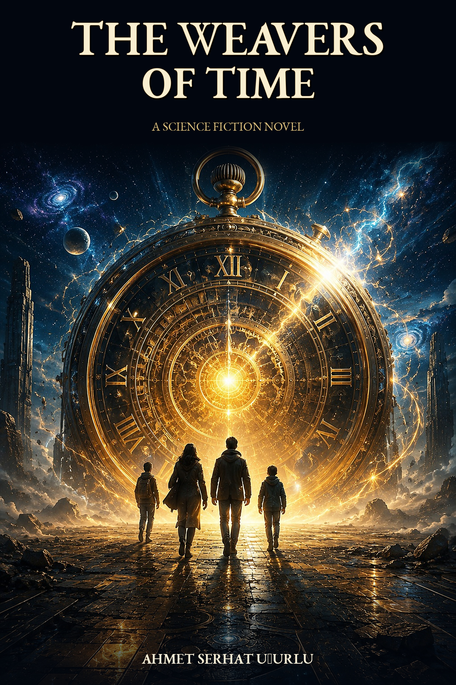

 

# Zamanın Dokumacıları / The Weavers of Time

### Ahmet Serhat Uğurlu tarafından yazılmış ücretsiz bir bilimkurgu romanı  
### A free science-fiction novel by Ahmet Serhat Uğurlu

**Geçmiş sizi duyabilseydi, ona ne söylerdiniz?**  
**If the past could hear you, what would you say?**

---

## Türkçe Sürüm

[📕 PDF İndir](https://github.com/aserhat81/Zamanin-Dokumacilari/releases/download/v1.0.0/Zamanin_Dokumacilari.pdf)
&nbsp;&nbsp;
[📘 EPUB İndir](https://github.com/aserhat81/Zamanin-Dokumacilari/releases/download/v1.0.0/Zamanin_Dokumacilari.epub)

3025 yılında insanlık, zamanın izlerine ulaşmayı sağlayan deneysel bir sistem geliştirir.

Bilge, Aybike, Göktuğ, Alp ve zamanın yankılarını hissedebilen Umay; geçmişe dokunmanın geleceği kurtarıp kurtaramayacağını anlamaya çalışır.

**Zamanın Dokumacıları**; kader, özgür irade, yapay zekâ, tarih ve zamanın doğası üzerine kurulu felsefi bir bilimkurgu romanıdır.

> Son sayfaya geldiğinizde ilk bölümü yeniden okumak isteyebilirsiniz.

---

## English Edition

[📕 Download PDF](https://github.com/aserhat81/Zamanin-Dokumacilari/releases/download/v1.0.0/The_Weavers_of_Time.pdf)
&nbsp;&nbsp;
[📘 Download EPUB](https://github.com/aserhat81/Zamanin-Dokumacilari/releases/download/v1.0.0/The_Weavers_of_Time.epub)

In the year 3025, humanity develops an experimental system capable of reaching the traces left by time.

Bilge, Aybike, Göktuğ, Alp, and Umay—who can sense the echoes of time—must discover whether touching the past can truly save the future.

**The Weavers of Time** is a philosophical science-fiction novel about destiny, free will, artificial intelligence, history, and the nature of time.

> When you reach the final page, you may want to read the first chapter again.

---

## Ücretsiz Yayın / Free Edition

Kitap Türkçe ve İngilizce olarak PDF ve EPUB biçimlerinde ücretsiz yayımlanmıştır.

The novel is published free of charge in Turkish and English as PDF and EPUB.

---

## Paylaşım Koşulları / Sharing Terms

© 2026 Ahmet Serhat Uğurlu. Tüm hakları saklıdır. / All rights reserved.

Dosyalar; değiştirilmemek, yazar adı kaldırılmamak, başka bir isimle yayımlanmamak, satılmamak ve ticari amaçla kullanılmamak şartıyla ücretsiz olarak paylaşılabilir.

The files may be shared free of charge only if they remain unaltered, retain the author's name, are not republished under another title, and are not sold or used commercially.
